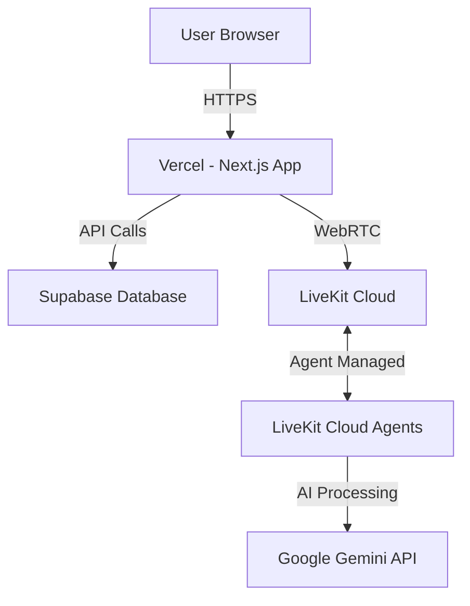

# Deployment Guide

This guide covers deploying your AI Interview application to production. The deployment consists of two parts:

1. **Next.js Frontend & API** → Vercel
2. **LiveKit Agent** → **LiveKit Cloud** (Recommended) or Railway/Render

## Architecture Overview



---

## Part 1: Deploy Next.js App to Vercel

### Prerequisites

- GitHub account
- Vercel account (free tier works)
- Supabase project
- LiveKit Cloud account
- Google AI API key

### Step 1: Prepare Your Repository

1. **Ensure `.gitignore` is configured** (already done):
   ```bash
   # Check that .env files are ignored
   cat .gitignore | grep .env
   ```

2. **Push your code to GitHub**:
   ```bash
   git add .
   git commit -m "Prepare for Vercel deployment"
   git push origin main
   ```

### Step 2: Deploy to Vercel

1. **Go to [Vercel Dashboard](https://vercel.com/dashboard)**

2. **Click "Add New Project"**

3. **Import your GitHub repository**

4. **Configure Build Settings**:
   - **Framework Preset**: Next.js
   - **Root Directory**: `./` (leave as default)
   - **Build Command**: `npm run build`
   - **Output Directory**: `.next` (auto-detected)
   - **Install Command**: `npm install`

5. **Add Environment Variables** (click "Environment Variables"):

   ```env
   # Supabase
   NEXT_PUBLIC_SUPABASE_URL=your_supabase_url
   NEXT_PUBLIC_SUPABASE_ANON_KEY=your_supabase_anon_key
   SUPABASE_SERVICE_ROLE_KEY=your_service_role_key
   
   # LiveKit
   NEXT_PUBLIC_LIVEKIT_URL=wss://your-project.livekit.cloud
   LIVEKIT_API_KEY=your_livekit_api_key
   LIVEKIT_API_SECRET=your_livekit_api_secret
   
   # Google AI
   GOOGLE_AI_API_KEY=your_google_ai_api_key
   ```

6. **Click "Deploy"**

7. **Wait for deployment** (usually 2-3 minutes)

### Step 3: Verify Deployment

Once deployed, test your application:

- ✅ Homepage loads
- ✅ Authentication works
- ✅ Dashboard displays
- ⚠️ Live interview won't work yet (agent not deployed)

---

## Part 2: Deploy LiveKit Agent

> **Recommended**: Deploy to **LiveKit Cloud** for the best integration, automatic scaling, and built-in observability!

### Option A: Deploy to LiveKit Cloud (⭐ Recommended)

LiveKit Cloud provides **fully-managed agent hosting** with automatic scaling, global distribution, and built-in observability. This is the **easiest and most integrated** option.

#### Benefits of LiveKit Cloud:
- ✅ **Zero infrastructure management** - No servers to maintain
- ✅ **Automatic scaling** - Handles traffic spikes automatically
- ✅ **Global distribution** - Agents deployed to LiveKit's global network
- ✅ **Built-in observability** - Transcripts, logs, and audio recordings in one place
- ✅ **Rolling deployments** - Zero-downtime updates
- ✅ **Instant rollbacks** - Revert to previous versions instantly

#### Pricing:
- **$0.01 per agent session minute** (includes hosting, data transfer, and observability)
- More cost-effective than managing your own infrastructure for production use

#### Step 1: Install LiveKit CLI

```bash
# macOS
brew install livekit-cli

# Linux/WSL
curl -sSL https://get.livekit.io/cli | bash

# Or download from https://github.com/livekit/livekit-cli/releases
```

#### Step 2: Authenticate with LiveKit Cloud

```bash
# Navigate to your agent directory
cd agent

# Login to LiveKit Cloud
lk cloud auth

# This will open your browser to authenticate
# Follow the prompts to connect your LiveKit Cloud account
```

#### Step 3: Create Agent Deployment

```bash
# Create a new agent deployment
lk cloud agent create interview-agent

# The CLI will guide you through:
# 1. Selecting your LiveKit project
# 2. Configuring the agent name
# 3. Setting up environment variables
```

#### Step 4: Configure Environment Variables

When prompted, add these environment variables:

```env
GOOGLE_AI_API_KEY=your_google_ai_api_key
NODE_ENV=production
```

> **Note**: `LIVEKIT_URL`, `LIVEKIT_API_KEY`, and `LIVEKIT_API_SECRET` are automatically injected by LiveKit Cloud!

#### Step 5: Deploy Your Agent

```bash
# Deploy the agent to LiveKit Cloud
lk cloud agent deploy interview-agent

# The CLI will:
# 1. Build a Docker container from your Dockerfile
# 2. Push it to LiveKit Cloud's registry
# 3. Deploy it to the global network
# 4. Start handling interview sessions automatically
```

#### Step 6: Verify Deployment

```bash
# Check agent status
lk cloud agent list

# View agent logs
lk cloud agent logs interview-agent

# Monitor agent sessions
lk cloud agent sessions interview-agent
```

#### Step 7: Update Vercel (Optional)

With LiveKit Cloud, you **don't need** to set an `AGENT_URL` environment variable! The agent automatically connects to your LiveKit rooms.

However, if you have any API routes that need to trigger agent deployments, you can use the LiveKit Cloud API.

---

### Option B: Deploy to Railway

1. **Go to [Railway.app](https://railway.app/)**

2. **Sign up/Login with GitHub**

3. **Create New Project** → **Deploy from GitHub repo**

4. **Select your repository**

5. **Configure Service**:
   - **Root Directory**: `agent`
   - Railway will auto-detect the Dockerfile

6. **Add Environment Variables**:

   ```env
   LIVEKIT_URL=wss://your-project.livekit.cloud
   LIVEKIT_API_KEY=your_livekit_api_key
   LIVEKIT_API_SECRET=your_livekit_api_secret
   GOOGLE_AI_API_KEY=your_google_ai_api_key
   NODE_ENV=production
   ```

7. **Deploy**

8. **Copy the Railway URL** (e.g., `https://your-agent.railway.app`)

#### Step 3: Update Vercel Environment Variables

1. Go back to **Vercel Dashboard** → Your Project → **Settings** → **Environment Variables**

2. Add/Update:
   ```env
   AGENT_URL=https://your-agent.railway.app
   ```

3. **Redeploy** your Vercel app to pick up the new environment variable

---

### Option B: Deploy to Render

1. **Go to [Render.com](https://render.com/)**

2. **Create New Web Service**

3. **Connect your GitHub repository**

4. **Configure**:
   - **Name**: `ai-interview-agent`
   - **Root Directory**: `agent`
   - **Environment**: `Node`
   - **Build Command**: `npm install && npm run build`
   - **Start Command**: `npm start`
   - **Plan**: Free

5. **Add Environment Variables** (same as Railway)

6. **Create Web Service**

7. **Copy the Render URL** and update Vercel's `AGENT_URL`

---

### Option C: Deploy to a VPS (Advanced)

If you have a VPS (DigitalOcean, AWS EC2, etc.):

1. **SSH into your server**

2. **Install Node.js 20+**:
   ```bash
   curl -fsSL https://deb.nodesource.com/setup_20.x | sudo -E bash -
   sudo apt-get install -y nodejs
   ```

3. **Clone your repository**:
   ```bash
   git clone https://github.com/your-username/your-repo.git
   cd your-repo/agent
   ```

4. **Install dependencies**:
   ```bash
   npm install
   npm run build
   ```

5. **Create `.env` file** with your environment variables

6. **Install PM2** (process manager):
   ```bash
   sudo npm install -g pm2
   ```

7. **Start the agent**:
   ```bash
   pm2 start npm --name "interview-agent" -- start
   pm2 save
   pm2 startup
   ```

8. **Set up Nginx reverse proxy** (optional, for HTTPS):
   ```nginx
   server {
       listen 80;
       server_name your-domain.com;
       
       location / {
           proxy_pass http://localhost:8080;
           proxy_http_version 1.1;
           proxy_set_header Upgrade $http_upgrade;
           proxy_set_header Connection 'upgrade';
           proxy_set_header Host $host;
           proxy_cache_bypass $http_upgrade;
       }
   }
   ```

---

## Part 3: Post-Deployment Configuration

### 1. Update Supabase Settings

1. Go to **Supabase Dashboard** → **Authentication** → **URL Configuration**

2. Add your Vercel URL to **Site URL**:
   ```
   https://your-app.vercel.app
   ```

3. Add to **Redirect URLs**:
   ```
   https://your-app.vercel.app/auth/callback
   https://your-app.vercel.app/**
   ```

### 2. Configure LiveKit

1. Go to **LiveKit Cloud Dashboard** → **Settings**

2. Add your Vercel domain to **Allowed Origins**:
   ```
   https://your-app.vercel.app
   ```

### 3. Test the Full Flow

1. Visit your Vercel URL
2. Sign up/Login
3. Start a new interview
4. Verify the agent connects and responds

---

## Troubleshooting

### Agent Not Connecting

**Check agent logs**:
- **LiveKit Cloud**: `lk cloud agent logs interview-agent`
- **Railway**: Dashboard → Deployments → View Logs
- **Render**: Dashboard → Logs
- **VPS**: `pm2 logs interview-agent`

**Common issues**:
- ❌ Wrong LiveKit credentials → Check environment variables
- ❌ Agent not running → Verify deployment status with `lk cloud agent list`
- ❌ CORS errors → Add Vercel domain to LiveKit allowed origins
- ❌ Dockerfile build failed → Check `lk cloud agent logs` for build errors

**LiveKit Cloud specific**:
```bash
# Check agent status
lk cloud agent list

# View detailed logs
lk cloud agent logs interview-agent --follow

# Check active sessions
lk cloud agent sessions interview-agent

# Rollback to previous version if needed
lk cloud agent rollback interview-agent
```

### Build Failures on Vercel

**Check build logs** in Vercel Dashboard

**Common issues**:
- ❌ Missing environment variables → Add all required env vars
- ❌ TypeScript errors → Run `npm run build` locally first
- ❌ Dependency issues → Delete `node_modules` and `package-lock.json`, reinstall

### Database Connection Issues

- ❌ Check Supabase URL and keys
- ❌ Verify Supabase project is active
- ❌ Check database connection limits

---

## Monitoring & Maintenance

### Vercel

- **Analytics**: Vercel Dashboard → Analytics
- **Logs**: Vercel Dashboard → Deployments → Function Logs
- **Redeploy**: Vercel Dashboard → Deployments → Redeploy

### Railway/Render

- **Metrics**: Dashboard → Metrics
- **Logs**: Dashboard → Logs
- **Restart**: Dashboard → Settings → Restart

### Database

- **Monitor usage**: Supabase Dashboard → Database → Usage
- **Backup**: Supabase automatically backs up daily

---

## Environment Variables Reference

### Next.js App (Vercel)

| Variable | Description | Example |
|----------|-------------|---------|
| `NEXT_PUBLIC_SUPABASE_URL` | Supabase project URL | `https://xxx.supabase.co` |
| `NEXT_PUBLIC_SUPABASE_ANON_KEY` | Supabase anonymous key | `eyJhbGc...` |
| `SUPABASE_SERVICE_ROLE_KEY` | Supabase service role key | `eyJhbGc...` |
| `NEXT_PUBLIC_LIVEKIT_URL` | LiveKit WebSocket URL | `wss://xxx.livekit.cloud` |
| `LIVEKIT_API_KEY` | LiveKit API key | `APIxxx` |
| `LIVEKIT_API_SECRET` | LiveKit API secret | `xxx` |
| `GOOGLE_AI_API_KEY` | Google AI API key | `AIzaSy...` |
| `AGENT_URL` | Agent server URL | `https://xxx.railway.app` |

### Agent (Railway/Render/VPS)

| Variable | Description | Example |
|----------|-------------|---------|
| `LIVEKIT_URL` | LiveKit WebSocket URL | `wss://xxx.livekit.cloud` |
| `LIVEKIT_API_KEY` | LiveKit API key | `APIxxx` |
| `LIVEKIT_API_SECRET` | LiveKit API secret | `xxx` |
| `GOOGLE_AI_API_KEY` | Google AI API key | `AIzaSy...` |
| `NODE_ENV` | Environment | `production` |

---

## Cost Estimation

### Free Tier Limits

- **Vercel**: 100GB bandwidth, unlimited deployments
- **Supabase**: 500MB database, 2GB bandwidth
- **LiveKit**: 50GB bandwidth/month free (WebRTC)
- **LiveKit Cloud Agents**: Pay-per-use ($0.01/minute)
- **Railway** (if used): $5 free credit/month (~500 hours)
- **Render** (if used): 750 hours/month free

### Estimated Monthly Costs

#### Using LiveKit Cloud (Recommended)

**Low Traffic** (10 interviews/month, 30 min each):
- **Vercel**: $0 (within free tier)
- **Supabase**: $0 (within free tier)
- **LiveKit WebRTC**: $0 (within free tier)
- **LiveKit Cloud Agents**: 10 × 30 min × $0.01 = **$3**
- **Total**: **~$3/month**

**Medium Traffic** (100 interviews/month, 30 min each):
- **Vercel**: $0 (within free tier)
- **Supabase**: $0-8 (may exceed free tier)
- **LiveKit WebRTC**: $0-10 (may exceed free tier)
- **LiveKit Cloud Agents**: 100 × 30 min × $0.01 = **$30**
- **Total**: **~$30-50/month**

**High Traffic** (500 interviews/month, 30 min each):
- **Vercel**: $20 (Pro plan recommended)
- **Supabase**: $25 (Pro plan)
- **LiveKit**: $50-100 (depends on bandwidth)
- **LiveKit Cloud Agents**: 500 × 30 min × $0.01 = **$150**
- **Total**: **~$245-295/month**

#### Using Railway/Render (Self-Hosted Agent)

**Low Traffic**:
- **Vercel**: $0
- **Supabase**: $0
- **LiveKit**: $0
- **Railway/Render**: $0 (within free tier)
- **Total**: **$0/month** (but requires more maintenance)

**Medium-High Traffic**:
- Self-hosting becomes complex with scaling, monitoring, and maintenance
- LiveKit Cloud is recommended for production use

---

## Next Steps

1. ✅ Deploy Next.js app to Vercel
2. ✅ Deploy agent to Railway/Render
3. ✅ Configure environment variables
4. ✅ Test full interview flow
5. 🔄 Set up custom domain (optional)
6. 🔄 Configure analytics (optional)
7. 🔄 Set up monitoring alerts (optional)

---

## Support

If you encounter issues:

1. Check the troubleshooting section above
2. Review deployment logs
3. Verify all environment variables are set correctly
4. Test locally first with production environment variables

Good luck with your deployment! 🚀
