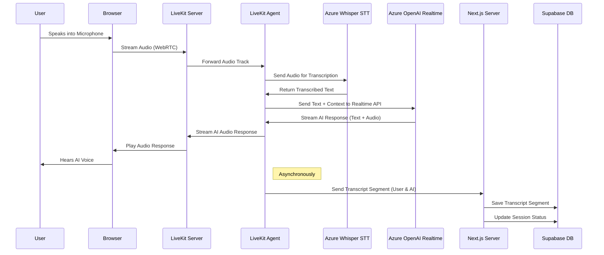
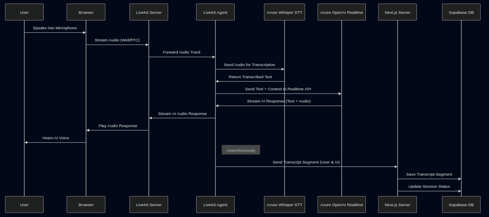

# Data Flow Diagram
## AI Interviewer Platform

### 1. User Interview Loop
This describes the high-level data movement during a live interview session.

### 2. Data Persistence Flow
How data moves from temporary session state to permanent storage.

- **Input**: User fills "Start Interview" form.
- **Process**:
    1. **Initialization**: 
        - Application verifies user has ≥ 120s remaining balance.
        - Server creates a row in `interview_sessions` with status `in_progress`.
    2. **Live Session**: Transcripts are buffered in state and periodically pushed to `interview_sessions.transcript` JSONB column.
    3. **Completion**: When user clicks "End Interview":
        - Final transcript is flushed to DB.
        - **Validation**: System checks if duration ≥ 2 mins AND user turns ≥ 2.
        - If valid, `interview.service` triggers generation of Feedback.
        - If invalid, session is marked with "Insufficient Data" and feedback generation is skipped.
- **Output**: `interview_sessions` row status updated to `completed`.

### 3. Feedback Generation Flow (Post-Interview)
- **Trigger**: Session Completion.
- **Input**: Full Transcript + Interview Configuration (Role, Difficulty).
- **Process**:
    - System constructs a large prompt with the entire conversation context.
    - Sends prompt to **Gemini AI** (Optimized for reasoning and analysis).
    - Receives JSON-structured analysis (Strengths, Weaknesses, Score).
- **Storage**: JSON response saved to `interview_sessions.feedback`.
- **Note**: Gemini AI is **only** used for feedback report generation, not for the real-time interview conversation.

