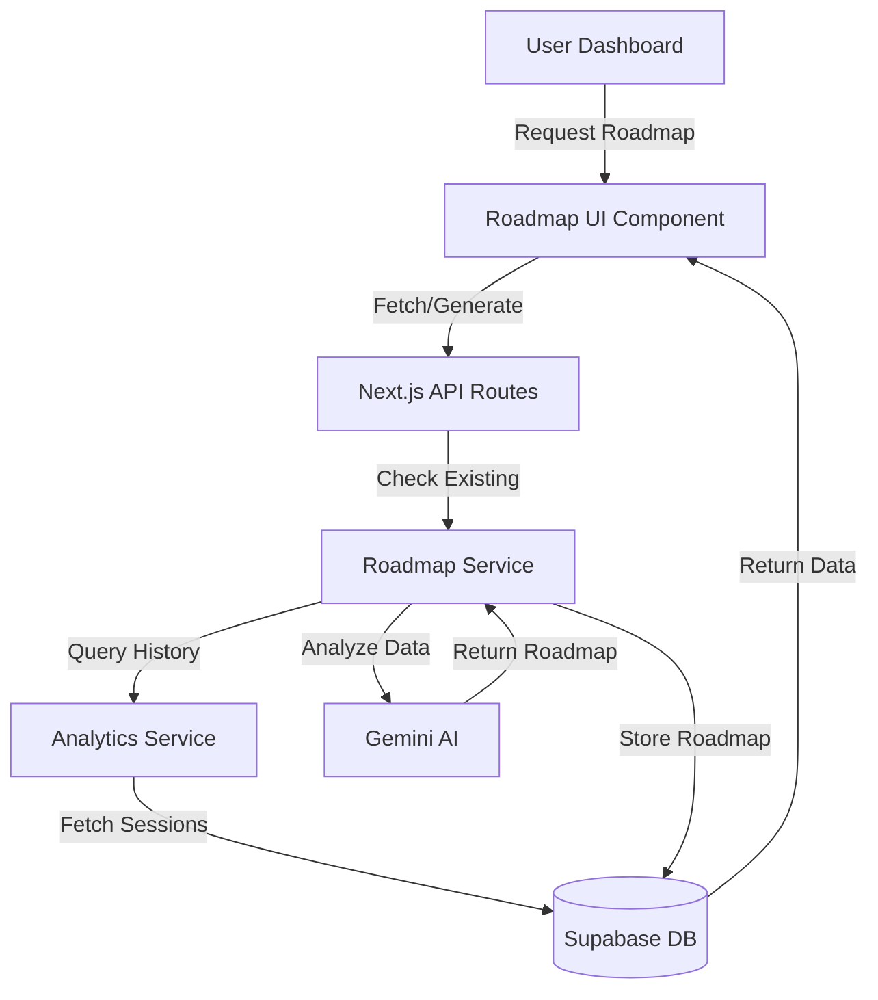
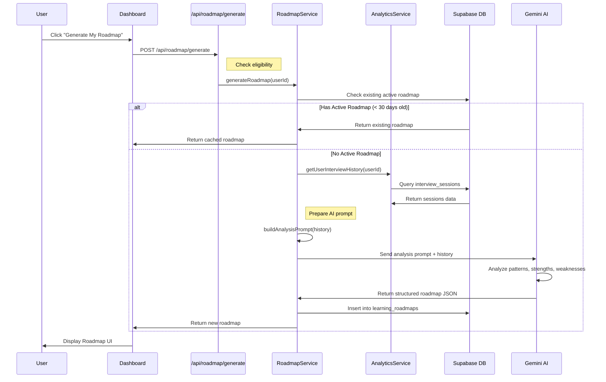
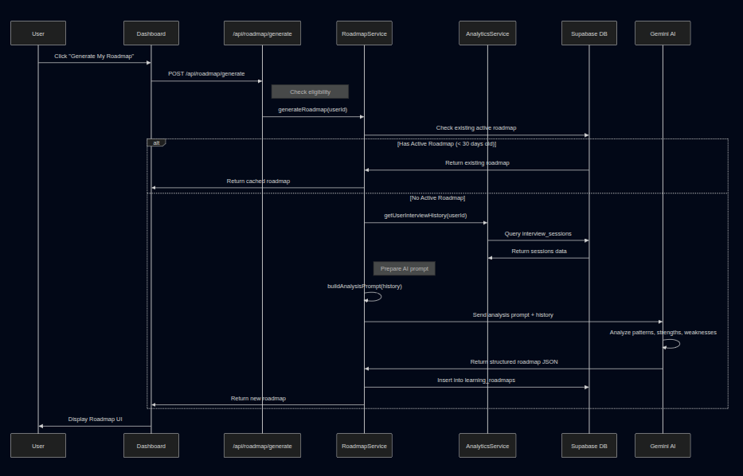
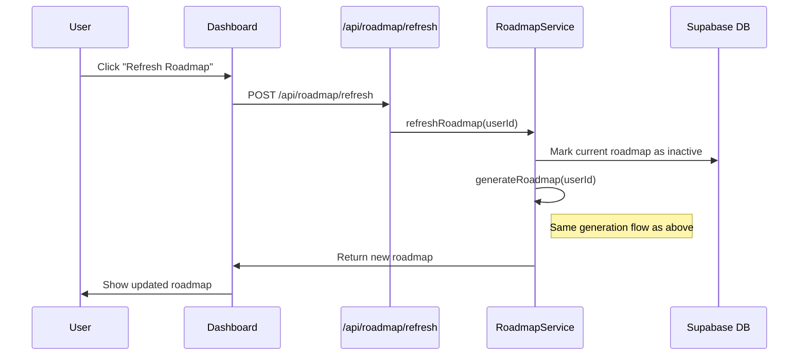
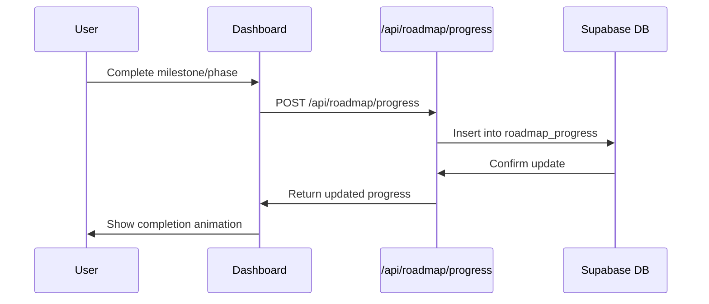
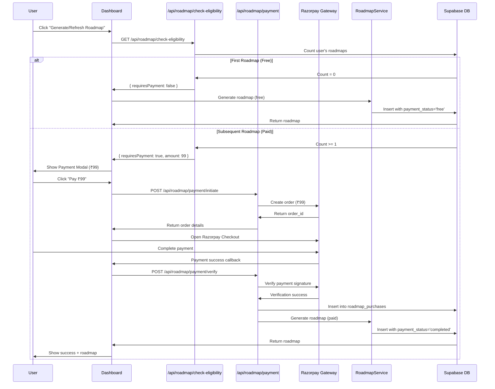

# Personalized Learning Roadmap Feature
## AI-Generated Roadmap (Option A)

### 1. Feature Overview
The Personalized Learning Roadmap analyzes a candidate's interview history using **Gemini AI** to generate a customized improvement plan with actionable steps, milestones, and recommended practice sessions.

---

## 1.1 Monetization Strategy

### Pricing Model
- **Free Tier**: 1 free roadmap per user (lifetime)
- **Paid Roadmaps**: ₹99 per additional roadmap generation

### Business Logic
1. **First Roadmap**: Automatically free for all users
2. **Subsequent Roadmaps**: Require payment of ₹99 each
3. **Refresh vs New**: Refreshing an existing roadmap counts as a new generation (requires payment after first free one)

### User Journey
```
User completes 3+ interviews
  ↓
Eligible for roadmap generation
  ↓
First Generation → FREE ✓
  ↓
User wants to refresh/regenerate
  ↓
Show Payment Modal → ₹99
  ↓
Payment Success → Generate New Roadmap
```

### Revenue Potential
- **Target**: 10,000 active users
- **Conversion Rate**: 15% purchase additional roadmap
- **Monthly Revenue**: 1,500 users × ₹99 = ₹1,48,500 (~$1,800)
- **Annual Revenue**: ~₹17,82,000 (~$21,600)

---

## 2. System Architecture

### 2.1 High-Level Components



---

## 3. Data Flow Diagram

### 3.1 Roadmap Generation Flow



### 3.2 Roadmap Refresh Flow



### 3.3 Progress Tracking Flow



### 3.4 Payment Flow (Paid Roadmaps)



---

## 4. Database Schema

### 4.1 New Tables

```sql
-- Store generated roadmaps
CREATE TABLE learning_roadmaps (
  id UUID PRIMARY KEY DEFAULT uuid_generate_v4(),
  user_id UUID NOT NULL REFERENCES profiles(id) ON DELETE CASCADE,
  
  -- Roadmap metadata
  version INT DEFAULT 1,
  overall_level TEXT CHECK (overall_level IN ('Beginner', 'Intermediate', 'Advanced')),
  
  -- Full roadmap structure (JSON)
  roadmap_data JSONB NOT NULL,
  
  -- Payment tracking
  is_paid BOOLEAN DEFAULT false,
  payment_amount DECIMAL(10, 2) DEFAULT 0,
  payment_id TEXT, -- Razorpay/Stripe payment ID
  payment_status TEXT CHECK (payment_status IN ('free', 'pending', 'completed', 'failed')),
  
  -- Lifecycle management
  generated_at TIMESTAMP DEFAULT NOW(),
  expires_at TIMESTAMP DEFAULT (NOW() + INTERVAL '30 days'),
  is_active BOOLEAN DEFAULT true,
  
  -- Audit
  created_at TIMESTAMP DEFAULT NOW(),
  updated_at TIMESTAMP DEFAULT NOW()
);

-- Track user progress on roadmap
CREATE TABLE roadmap_progress (
  id UUID PRIMARY KEY DEFAULT uuid_generate_v4(),
  roadmap_id UUID NOT NULL REFERENCES learning_roadmaps(id) ON DELETE CASCADE,
  user_id UUID NOT NULL REFERENCES profiles(id) ON DELETE CASCADE,
  
  -- Progress details
  phase_number INT,
  milestone_id TEXT,
  item_type TEXT CHECK (item_type IN ('phase', 'milestone', 'goal', 'interview')),
  
  -- Completion tracking
  completed_at TIMESTAMP DEFAULT NOW(),
  notes TEXT,
  
  created_at TIMESTAMP DEFAULT NOW()
);

-- Track roadmap purchases (for analytics and refunds)
CREATE TABLE roadmap_purchases (
  id UUID PRIMARY KEY DEFAULT uuid_generate_v4(),
  user_id UUID NOT NULL REFERENCES profiles(id) ON DELETE CASCADE,
  roadmap_id UUID REFERENCES learning_roadmaps(id) ON DELETE SET NULL,
  
  -- Payment details
  amount DECIMAL(10, 2) NOT NULL,
  currency TEXT DEFAULT 'INR',
  payment_gateway TEXT DEFAULT 'razorpay', -- razorpay, stripe, etc.
  payment_id TEXT NOT NULL,
  payment_status TEXT CHECK (payment_status IN ('pending', 'completed', 'failed', 'refunded')),
  
  -- Metadata
  metadata JSONB,
  
  -- Timestamps
  created_at TIMESTAMP DEFAULT NOW(),
  updated_at TIMESTAMP DEFAULT NOW()
);

-- Indexes for performance
CREATE INDEX idx_learning_roadmaps_user_active ON learning_roadmaps(user_id, is_active);
CREATE INDEX idx_learning_roadmaps_payment ON learning_roadmaps(user_id, payment_status);
CREATE INDEX idx_roadmap_progress_roadmap ON roadmap_progress(roadmap_id);
CREATE INDEX idx_roadmap_progress_user ON roadmap_progress(user_id);
CREATE INDEX idx_roadmap_purchases_user ON roadmap_purchases(user_id);
CREATE INDEX idx_roadmap_purchases_payment ON roadmap_purchases(payment_id);
```
```

### 4.2 Roadmap Data Structure (JSONB)

```typescript
interface RoadmapData {
  // Analysis Summary
  analysis: {
    total_interviews: number;
    average_score: number;
    completion_rate: number; // % of completed vs abandoned
    strengths: string[];
    weaknesses: string[];
    trend: 'improving' | 'stable' | 'declining';
  };
  
  // Improvement Areas
  improvement_areas: {
    skill: string;
    current_level: number; // 1-10
    target_level: number;
    priority: 'High' | 'Medium' | 'Low';
    estimated_time_weeks: number;
  }[];
  
  // Phased Roadmap
  phases: {
    phase_number: number;
    title: string;
    description: string;
    duration_weeks: number;
    
    // Goals for this phase
    goals: {
      id: string;
      description: string;
      success_criteria: string;
    }[];
    
    // Recommended practice
    recommended_interviews: {
      template_id: string;
      template_title: string;
      difficulty: 'Beginner' | 'Intermediate' | 'Advanced';
      frequency: string; // "2x per week"
      focus_areas: string[];
    }[];
    
    // Learning resources
    learning_resources: {
      type: 'article' | 'video' | 'practice' | 'book';
      title: string;
      description: string;
      url?: string;
      estimated_time_minutes?: number;
    }[];
  }[];
  
  // Milestones
  milestones: {
    id: string;
    title: string;
    description: string;
    target_score: number;
    phase_number: number;
    estimated_date: string;
  }[];
  
  // Metadata
  generated_by: 'gemini-ai';
  model_version: string;
}
```

---

## 5. Backend Implementation

### 5.1 Service Layer

#### File: `src/services/roadmap.service.ts`

```typescript
import { GoogleGenerativeAI } from '@google/generative-ai';
import { createClient } from '@/integrations/supabase/client';
import { analyticsService } from './analytics.service';

class RoadmapService {
  private genAI: GoogleGenerativeAI;
  
  constructor() {
    this.genAI = new GoogleGenerativeAI(process.env.GEMINI_API_KEY!);
  }
  
  /**
   * Check if user needs to pay for roadmap generation
   */
  async checkPaymentEligibility(userId: string) {
    const supabase = createClient();
    
    // Count total roadmaps generated by user
    const { count } = await supabase
      .from('learning_roadmaps')
      .select('*', { count: 'exact', head: true })
      .eq('user_id', userId);
    
    const roadmapCount = count || 0;
    
    return {
      requiresPayment: roadmapCount >= 1,
      roadmapCount,
      amount: roadmapCount >= 1 ? 99 : 0,
      currency: 'INR',
    };
  }
  
  /**
   * Generate personalized roadmap for user
   * @param paymentId - Optional payment ID for paid roadmaps
   */
  async generateRoadmap(userId: string, paymentId?: string) {
    const supabase = createClient();
    
    // 1. Check payment eligibility
    const eligibility = await this.checkPaymentEligibility(userId);
    
    // 2. If payment required but not provided, throw error
    if (eligibility.requiresPayment && !paymentId) {
      throw new Error('Payment required for additional roadmap');
    }
    
    // 3. Check for existing active roadmap
    const existing = await this.getActiveRoadmap(userId);
    if (existing && !this.isExpired(existing)) {
      return existing;
    }
    
    // 4. Fetch user's interview history
    const history = await analyticsService.getUserInterviewHistory(userId);
    
    // 5. Check eligibility (minimum 3 completed interviews)
    if (history.completed.length < 3) {
      throw new Error('Minimum 3 completed interviews required');
    }
    
    // 6. Build AI prompt
    const prompt = this.buildAnalysisPrompt(history);
    
    // 7. Call Gemini AI
    const model = this.genAI.getGenerativeModel({ model: 'gemini-1.5-pro' });
    const result = await model.generateContent(prompt);
    const roadmapData = JSON.parse(result.response.text());
    
    // 8. Determine overall level
    const overallLevel = this.calculateOverallLevel(history);
    
    // 9. Determine payment status
    const isFree = !eligibility.requiresPayment;
    const paymentStatus = isFree ? 'free' : 'completed';
    const paymentAmount = isFree ? 0 : 99;
    
    // 10. Store in database
    const { data, error } = await supabase
      .from('learning_roadmaps')
      .insert({
        user_id: userId,
        overall_level: overallLevel,
        roadmap_data: roadmapData,
        version: 1,
        is_paid: !isFree,
        payment_amount: paymentAmount,
        payment_id: paymentId || null,
        payment_status: paymentStatus,
      })
      .select()
      .single();
    
    if (error) throw error;
    return data;
  }
  
  /**
   * Build comprehensive prompt for Gemini AI
   */
  private buildAnalysisPrompt(history: any): string {
    return `
You are an expert career coach and technical interview mentor. Analyze the following interview history and create a personalized learning roadmap.

## Interview History Data:
${JSON.stringify(history, null, 2)}

## Your Task:
Generate a comprehensive, actionable learning roadmap in JSON format with the following structure:

{
  "analysis": {
    "total_interviews": <number>,
    "average_score": <number>,
    "completion_rate": <percentage>,
    "strengths": [<list of 3-5 key strengths>],
    "weaknesses": [<list of 3-5 areas needing improvement>],
    "trend": "improving" | "stable" | "declining"
  },
  "improvement_areas": [
    {
      "skill": "<skill name>",
      "current_level": <1-10>,
      "target_level": <1-10>,
      "priority": "High" | "Medium" | "Low",
      "estimated_time_weeks": <number>
    }
  ],
  "phases": [
    {
      "phase_number": 1,
      "title": "<phase title>",
      "description": "<what to focus on>",
      "duration_weeks": <number>,
      "goals": [
        {
          "id": "<unique-id>",
          "description": "<specific goal>",
          "success_criteria": "<how to measure success>"
        }
      ],
      "recommended_interviews": [
        {
          "template_id": "<from user's available templates>",
          "template_title": "<title>",
          "difficulty": "Beginner" | "Intermediate" | "Advanced",
          "frequency": "<e.g., 2x per week>",
          "focus_areas": [<specific skills to practice>]
        }
      ],
      "learning_resources": [
        {
          "type": "article" | "video" | "practice",
          "title": "<resource title>",
          "description": "<brief description>",
          "url": "<optional URL>",
          "estimated_time_minutes": <number>
        }
      ]
    }
  ],
  "milestones": [
    {
      "id": "<unique-id>",
      "title": "<milestone title>",
      "description": "<what this achieves>",
      "target_score": <score to achieve>,
      "phase_number": <which phase>,
      "estimated_date": "<YYYY-MM-DD>"
    }
  ]
}

## Guidelines:
1. Create 3-4 phases spanning 8-12 weeks total
2. Be specific and actionable
3. Consider the user's current skill level and progression
4. Include both technical and soft skills
5. Suggest realistic practice frequency
6. Provide diverse learning resources
7. Set achievable milestones

Return ONLY valid JSON, no markdown formatting.
    `;
  }
  
  /**
   * Get active roadmap for user
   */
  async getActiveRoadmap(userId: string) {
    const supabase = createClient();
    const { data } = await supabase
      .from('learning_roadmaps')
      .select('*')
      .eq('user_id', userId)
      .eq('is_active', true)
      .order('created_at', { ascending: false })
      .limit(1)
      .single();
    
    return data;
  }
  
  /**
   * Refresh roadmap (deactivate old, generate new)
   */
  async refreshRoadmap(userId: string) {
    const supabase = createClient();
    
    // Deactivate current roadmap
    await supabase
      .from('learning_roadmaps')
      .update({ is_active: false })
      .eq('user_id', userId)
      .eq('is_active', true);
    
    // Generate new one
    return this.generateRoadmap(userId);
  }
  
  /**
   * Track progress on roadmap item
   */
  async trackProgress(
    userId: string,
    roadmapId: string,
    itemType: string,
    itemId: string,
    notes?: string
  ) {
    const supabase = createClient();
    
    const { data, error } = await supabase
      .from('roadmap_progress')
      .insert({
        roadmap_id: roadmapId,
        user_id: userId,
        item_type: itemType,
        milestone_id: itemId,
        notes,
      })
      .select()
      .single();
    
    if (error) throw error;
    return data;
  }
  
  /**
   * Get user's progress on current roadmap
   */
  async getProgress(userId: string, roadmapId: string) {
    const supabase = createClient();
    
    const { data } = await supabase
      .from('roadmap_progress')
      .select('*')
      .eq('user_id', userId)
      .eq('roadmap_id', roadmapId)
      .order('completed_at', { ascending: false });
    
    return data || [];
  }
  
  /**
   * Calculate overall skill level
   */
  private calculateOverallLevel(history: any): string {
    const avgScore = history.average_score || 0;
    
    if (avgScore < 50) return 'Beginner';
    if (avgScore < 75) return 'Intermediate';
    return 'Advanced';
  }
  
  /**
   * Check if roadmap is expired
   */
  private isExpired(roadmap: any): boolean {
    return new Date(roadmap.expires_at) < new Date();
  }
}

export const roadmapService = new RoadmapService();
```

### 5.2 API Routes

#### File: `src/app/api/roadmap/generate/route.ts`

```typescript
import { NextRequest, NextResponse } from 'next/server';
import { createClient } from '@/integrations/supabase/server';
import { roadmapService } from '@/services/roadmap.service';

export async function POST(request: NextRequest) {
  try {
    const supabase = await createClient();
    
    // Get authenticated user
    const { data: { user }, error: authError } = await supabase.auth.getUser();
    if (authError || !user) {
      return NextResponse.json({ error: 'Unauthorized' }, { status: 401 });
    }
    
    // Generate roadmap
    const roadmap = await roadmapService.generateRoadmap(user.id);
    
    return NextResponse.json({ roadmap }, { status: 200 });
  } catch (error: any) {
    console.error('Roadmap generation error:', error);
    return NextResponse.json(
      { error: error.message || 'Failed to generate roadmap' },
      { status: 500 }
    );
  }
}

export async function GET(request: NextRequest) {
  try {
    const supabase = await createClient();
    
    const { data: { user }, error: authError } = await supabase.auth.getUser();
    if (authError || !user) {
      return NextResponse.json({ error: 'Unauthorized' }, { status: 401 });
    }
    
    // Get active roadmap
    const roadmap = await roadmapService.getActiveRoadmap(user.id);
    
    if (!roadmap) {
      return NextResponse.json({ roadmap: null }, { status: 200 });
    }
    
    // Get progress
    const progress = await roadmapService.getProgress(user.id, roadmap.id);
    
    return NextResponse.json({ roadmap, progress }, { status: 200 });
  } catch (error: any) {
    console.error('Roadmap fetch error:', error);
    return NextResponse.json(
      { error: error.message || 'Failed to fetch roadmap' },
      { status: 500 }
    );
  }
}
```

#### File: `src/app/api/roadmap/refresh/route.ts`

```typescript
import { NextRequest, NextResponse } from 'next/server';
import { createClient } from '@/integrations/supabase/server';
import { roadmapService } from '@/services/roadmap.service';

export async function POST(request: NextRequest) {
  try {
    const supabase = await createClient();
    
    const { data: { user }, error: authError } = await supabase.auth.getUser();
    if (authError || !user) {
      return NextResponse.json({ error: 'Unauthorized' }, { status: 401 });
    }
    
    const roadmap = await roadmapService.refreshRoadmap(user.id);
    
    return NextResponse.json({ roadmap }, { status: 200 });
  } catch (error: any) {
    console.error('Roadmap refresh error:', error);
    return NextResponse.json(
      { error: error.message || 'Failed to refresh roadmap' },
      { status: 500 }
    );
  }
}
```

#### File: `src/app/api/roadmap/progress/route.ts`

```typescript
import { NextRequest, NextResponse } from 'next/server';
import { createClient } from '@/integrations/supabase/server';
import { roadmapService } from '@/services/roadmap.service';

export async function POST(request: NextRequest) {
  try {
    const supabase = await createClient();
    
    const { data: { user }, error: authError } = await supabase.auth.getUser();
    if (authError || !user) {
      return NextResponse.json({ error: 'Unauthorized' }, { status: 401 });
    }
    
    const body = await request.json();
    const { roadmapId, itemType, itemId, notes } = body;
    
    const progress = await roadmapService.trackProgress(
      user.id,
      roadmapId,
      itemType,
      itemId,
      notes
    );
    
    return NextResponse.json({ progress }, { status: 200 });
  } catch (error: any) {
    console.error('Progress tracking error:', error);
    return NextResponse.json(
      { error: error.message || 'Failed to track progress' },
      { status: 500 }
    );
  }
}
```

### 5.3 Payment API Routes

#### File: `src/app/api/roadmap/check-eligibility/route.ts`

```typescript
import { NextRequest, NextResponse } from 'next/server';
import { createClient } from '@/integrations/supabase/server';
import { roadmapService } from '@/services/roadmap.service';

export async function GET(request: NextRequest) {
  try {
    const supabase = await createClient();
    
    const { data: { user }, error: authError } = await supabase.auth.getUser();
    if (authError || !user) {
      return NextResponse.json({ error: 'Unauthorized' }, { status: 401 });
    }
    
    const eligibility = await roadmapService.checkPaymentEligibility(user.id);
    
    return NextResponse.json(eligibility, { status: 200 });
  } catch (error: any) {
    console.error('Eligibility check error:', error);
    return NextResponse.json(
      { error: error.message || 'Failed to check eligibility' },
      { status: 500 }
    );
  }
}
```

#### File: `src/app/api/roadmap/payment/initiate/route.ts`

```typescript
import { NextRequest, NextResponse } from 'next/server';
import { createClient } from '@/integrations/supabase/server';
import Razorpay from 'razorpay';

const razorpay = new Razorpay({
  key_id: process.env.RAZORPAY_KEY_ID!,
  key_secret: process.env.RAZORPAY_KEY_SECRET!,
});

export async function POST(request: NextRequest) {
  try {
    const supabase = await createClient();
    
    const { data: { user }, error: authError } = await supabase.auth.getUser();
    if (authError || !user) {
      return NextResponse.json({ error: 'Unauthorized' }, { status: 401 });
    }
    
    // Create Razorpay order
    const order = await razorpay.orders.create({
      amount: 9900, // ₹99 in paise
      currency: 'INR',
      receipt: `roadmap_${user.id}_${Date.now()}`,
      notes: {
        user_id: user.id,
        product: 'personalized_roadmap',
      },
    });
    
    return NextResponse.json({
      orderId: order.id,
      amount: order.amount,
      currency: order.currency,
      keyId: process.env.RAZORPAY_KEY_ID,
    }, { status: 200 });
  } catch (error: any) {
    console.error('Payment initiation error:', error);
    return NextResponse.json(
      { error: error.message || 'Failed to initiate payment' },
      { status: 500 }
    );
  }
}
```

#### File: `src/app/api/roadmap/payment/verify/route.ts`

```typescript
import { NextRequest, NextResponse } from 'next/server';
import { createClient } from '@/integrations/supabase/server';
import { roadmapService } from '@/services/roadmap.service';
import crypto from 'crypto';

export async function POST(request: NextRequest) {
  try {
    const supabase = await createClient();
    
    const { data: { user }, error: authError } = await supabase.auth.getUser();
    if (authError || !user) {
      return NextResponse.json({ error: 'Unauthorized' }, { status: 401 });
    }
    
    const body = await request.json();
    const { razorpay_order_id, razorpay_payment_id, razorpay_signature } = body;
    
    // Verify payment signature
    const sign = razorpay_order_id + '|' + razorpay_payment_id;
    const expectedSign = crypto
      .createHmac('sha256', process.env.RAZORPAY_KEY_SECRET!)
      .update(sign.toString())
      .digest('hex');
    
    if (razorpay_signature !== expectedSign) {
      return NextResponse.json({ error: 'Invalid payment signature' }, { status: 400 });
    }
    
    // Record purchase in database
    const { data: purchase, error: purchaseError } = await supabase
      .from('roadmap_purchases')
      .insert({
        user_id: user.id,
        amount: 99,
        currency: 'INR',
        payment_gateway: 'razorpay',
        payment_id: razorpay_payment_id,
        payment_status: 'completed',
        metadata: {
          order_id: razorpay_order_id,
          signature: razorpay_signature,
        },
      })
      .select()
      .single();
    
    if (purchaseError) throw purchaseError;
    
    // Generate roadmap with payment ID
    const roadmap = await roadmapService.generateRoadmap(user.id, razorpay_payment_id);
    
    // Link purchase to roadmap
    await supabase
      .from('roadmap_purchases')
      .update({ roadmap_id: roadmap.id })
      .eq('id', purchase.id);
    
    return NextResponse.json({
      success: true,
      roadmap,
      purchase,
    }, { status: 200 });
  } catch (error: any) {
    console.error('Payment verification error:', error);
    return NextResponse.json(
      { error: error.message || 'Failed to verify payment' },
      { status: 500 }
    );
  }
}
```

---

## 6. Frontend Implementation

### 6.1 UI Flow

```
Dashboard
  └─> "My Roadmap" Tab/Section
       ├─> [No Roadmap] → "Generate Roadmap" Button
       │    └─> Loading State (AI analyzing...)
       │         └─> Roadmap Display
       │
       └─> [Has Roadmap] → Roadmap Display
            ├─> Overview Section (Strengths/Weaknesses)
            ├─> Improvement Areas (Priority-based)
            ├─> Phased Plan (Expandable phases)
            │    ├─> Phase 1 (Current)
            │    ├─> Phase 2 (Locked until Phase 1 complete)
            │    └─> Phase 3 (Locked)
            ├─> Milestones Timeline
            ├─> Progress Tracker (% complete)
            └─> Actions
                 ├─> "Refresh Roadmap" Button
                 ├─> "Mark as Complete" (for items)
                 └─> "Start Recommended Interview" (quick action)
```

### 6.2 Component Structure

#### File: `src/app/dashboard/roadmap/page.tsx`

```typescript
'use client';

import { useState, useEffect } from 'react';
import { useQuery, useMutation } from '@tanstack/react-query';
import { RoadmapOverview } from '@/components/roadmap/RoadmapOverview';
import { RoadmapPhases } from '@/components/roadmap/RoadmapPhases';
import { RoadmapMilestones } from '@/components/roadmap/RoadmapMilestones';
import { Button } from '@/components/ui/button';
import { Loader2, RefreshCw, Sparkles } from 'lucide-react';

export default function RoadmapPage() {
  const [isGenerating, setIsGenerating] = useState(false);
  
  // Fetch existing roadmap
  const { data, isLoading, refetch } = useQuery({
    queryKey: ['roadmap'],
    queryFn: async () => {
      const res = await fetch('/api/roadmap/generate');
      if (!res.ok) throw new Error('Failed to fetch roadmap');
      return res.json();
    },
  });
  
  // Generate new roadmap
  const generateMutation = useMutation({
    mutationFn: async () => {
      const res = await fetch('/api/roadmap/generate', { method: 'POST' });
      if (!res.ok) throw new Error('Failed to generate roadmap');
      return res.json();
    },
    onSuccess: () => {
      refetch();
      setIsGenerating(false);
    },
  });
  
  // Refresh roadmap
  const refreshMutation = useMutation({
    mutationFn: async () => {
      const res = await fetch('/api/roadmap/refresh', { method: 'POST' });
      if (!res.ok) throw new Error('Failed to refresh roadmap');
      return res.json();
    },
    onSuccess: () => {
      refetch();
    },
  });
  
  const handleGenerate = () => {
    setIsGenerating(true);
    generateMutation.mutate();
  };
  
  if (isLoading) {
    return (
      <div className="flex items-center justify-center h-96">
        <Loader2 className="w-8 h-8 animate-spin" />
      </div>
    );
  }
  
  if (!data?.roadmap) {
    return (
      <div className="max-w-2xl mx-auto text-center py-16">
        <Sparkles className="w-16 h-16 mx-auto mb-4 text-primary" />
        <h2 className="text-2xl font-bold mb-2">Get Your Personalized Roadmap</h2>
        <p className="text-muted-foreground mb-6">
          Our AI will analyze your interview history and create a customized learning plan.
        </p>
        <Button
          size="lg"
          onClick={handleGenerate}
          disabled={isGenerating}
        >
          {isGenerating ? (
            <>
              <Loader2 className="w-4 h-4 mr-2 animate-spin" />
              Analyzing Your Progress...
            </>
          ) : (
            <>
              <Sparkles className="w-4 h-4 mr-2" />
              Generate My Roadmap
            </>
          )}
        </Button>
      </div>
    );
  }
  
  return (
    <div className="space-y-6">
      {/* Header */}
      <div className="flex items-center justify-between">
        <div>
          <h1 className="text-3xl font-bold">Your Learning Roadmap</h1>
          <p className="text-muted-foreground">
            Generated {new Date(data.roadmap.generated_at).toLocaleDateString()}
          </p>
        </div>
        <Button
          variant="outline"
          onClick={() => refreshMutation.mutate()}
          disabled={refreshMutation.isPending}
        >
          {refreshMutation.isPending ? (
            <Loader2 className="w-4 h-4 mr-2 animate-spin" />
          ) : (
            <RefreshCw className="w-4 h-4 mr-2" />
          )}
          Refresh Roadmap
        </Button>
      </div>
      
      {/* Overview */}
      <RoadmapOverview data={data.roadmap.roadmap_data.analysis} />
      
      {/* Phases */}
      <RoadmapPhases
        phases={data.roadmap.roadmap_data.phases}
        progress={data.progress}
        roadmapId={data.roadmap.id}
      />
      
      {/* Milestones */}
      <RoadmapMilestones
        milestones={data.roadmap.roadmap_data.milestones}
        progress={data.progress}
      />
    </div>
  );
}
```

### 6.3 Key UI Components

#### `RoadmapOverview.tsx` - Shows analysis summary
#### `RoadmapPhases.tsx` - Expandable phase cards with goals and recommendations
#### `RoadmapMilestones.tsx` - Timeline view of milestones
#### `ProgressTracker.tsx` - Visual progress indicator

---

## 7. User Experience Flow

### 7.1 First-Time User Journey

1. **User completes 3rd interview** → System shows notification: "Unlock your personalized roadmap!"
2. **User navigates to "My Roadmap"** → Sees empty state with "Generate Roadmap" button
3. **User clicks "Generate"** → Loading animation (15-30 seconds)
4. **Roadmap appears** → User sees:
   - Overall skill level badge
   - Strengths/weaknesses summary
   - 3-4 phase plan with specific goals
   - Timeline with milestones
5. **User explores Phase 1** → Sees recommended interviews, resources, goals
6. **User starts recommended interview** → Direct link to start interview
7. **After interview completion** → Progress auto-updates on roadmap

### 7.2 Returning User Journey

1. **User opens "My Roadmap"** → Sees current roadmap with progress
2. **User marks goals as complete** → Progress bar updates
3. **User completes Phase 1** → Phase 2 unlocks automatically
4. **After 30 days** → System suggests refreshing roadmap
5. **User clicks "Refresh"** → New roadmap generated with updated analysis

---

## 8. Implementation Timeline

### Week 1: Backend Foundation
- [ ] Create database tables and migrations
- [ ] Implement `roadmap.service.ts`
- [ ] Create API routes
- [ ] Test Gemini AI integration

### Week 2: Frontend UI
- [ ] Create roadmap page layout
- [ ] Build UI components (Overview, Phases, Milestones)
- [ ] Implement progress tracking
- [ ] Add loading states and animations

### Week 3: Integration & Polish
- [ ] Connect frontend to backend
- [ ] Add error handling
- [ ] Implement caching strategy
- [ ] Add analytics tracking

### Week 4: Testing & Launch
- [ ] User testing
- [ ] Performance optimization
- [ ] Documentation
- [ ] Soft launch to beta users

---

## 9. Cost Estimation

### Gemini AI Costs (Approximate)
- **Input tokens per roadmap**: ~5,000 tokens (interview history + prompt)
- **Output tokens per roadmap**: ~3,000 tokens (structured JSON)
- **Cost per roadmap**: ~$0.02 - $0.05
- **Monthly cost (1000 users, 1 roadmap each)**: ~$20 - $50

### Optimization Strategies
1. Cache roadmaps for 30 days
2. Only regenerate on user request or significant new data
3. Use Gemini Flash for faster, cheaper generation if quality is acceptable

---

## 10. Future Enhancements

- **V2.0**: Weekly email digests with progress updates
- **V2.1**: Integration with calendar for scheduled practice sessions
- **V2.2**: Peer comparison (anonymized) - "You're in top 20% for System Design"
- **V2.3**: Export roadmap as PDF
- **V2.4**: Share roadmap with mentors/coaches
- **V2.5**: AI-powered roadmap adjustments based on real-time performance

---

## 11. Success Metrics

Track these KPIs:
- **Adoption Rate**: % of eligible users who generate roadmap
- **Engagement Rate**: % of users who complete at least 1 phase
- **Completion Rate**: % of users who finish entire roadmap
- **Interview Frequency**: Does roadmap increase practice frequency?
- **Score Improvement**: Do users with roadmaps improve faster?
- **Retention**: Do users with roadmaps have higher retention?

### Monetization Metrics
- **Conversion Rate**: % of users who purchase additional roadmaps (Target: 15%)
- **Revenue per User**: Average revenue from roadmap purchases
- **Payment Success Rate**: % of successful payment transactions
- **Refund Rate**: % of roadmap purchases refunded
- **Time to Second Purchase**: Average days between first (free) and second (paid) roadmap
- **Repeat Purchase Rate**: % of users who buy 3+ roadmaps

---

## 12. Quick Reference

### Pricing Summary
| Tier | Price | Features |
|------|-------|----------|
| **Free** | ₹0 | 1 personalized roadmap (lifetime) |
| **Additional** | ₹99 each | Unlimited additional roadmaps |

### Key Endpoints
- `GET /api/roadmap/check-eligibility` - Check if payment required
- `POST /api/roadmap/payment/initiate` - Create Razorpay order
- `POST /api/roadmap/payment/verify` - Verify payment & generate roadmap
- `POST /api/roadmap/generate` - Generate roadmap (free or after payment)
- `GET /api/roadmap/generate` - Get active roadmap
- `POST /api/roadmap/refresh` - Refresh existing roadmap (requires payment if not first)

### Database Tables
- `learning_roadmaps` - Stores generated roadmaps with payment info
- `roadmap_progress` - Tracks user progress on roadmap items
- `roadmap_purchases` - Records all payment transactions

### Environment Variables Required
```bash
GEMINI_API_KEY=your_gemini_api_key
RAZORPAY_KEY_ID=your_razorpay_key_id
RAZORPAY_KEY_SECRET=your_razorpay_key_secret
```

