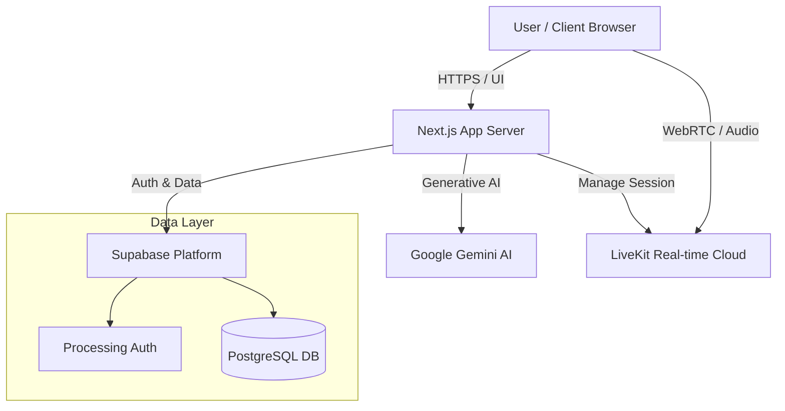

# System Architecture
## AI Interviewer Platform

### 1. Overview
The platform is built as a monolithic Next.js application that leverages serverless technologies for specialized functions (Auth, Database, AI).

### 2. High-Level Architecture

### 3. Component Details
#### 3.1 Frontend (Next.js 15)
- **Framework**: React 18 with Next.js App Router.
- **Styling**: Tailwind CSS + shadcn/ui.
- **State Management**: Zustand (Client state), TanStack Query (Server state).
- **Responsibility**: Renders UI, manages user session state, handles microphone input validation.

#### 3.2 Backend Services (Server-Side)
- **API Routes**: Next.js API routes (`src/app/api/`) handle sensitive operations.
- **Endpoints**:
    - `/api/livekit_token`: Generates secure tokens for real-time rooms.
    - `/api/interview`: specialized logic for session initialization.
- **Database Interaction**: Uses `@supabase/ssr` for secure server-side database access.

#### 3.3 Real-time Communication (LiveKit)
- **Role**: Handles the low-latency audio streaming between the user and the server logic.
- **Protocol**: WebRTC.
- **Integration**: The Next.js server acts as an orchestration layer, receiving audio events and forwarding transcripts/prompts to Gemini.

#### 3.4 AI Orchestration (Google Gemini)
- **Model**: Gemini 1.5 Pro / Flash.
- **Interaction**: The system uses the Google GenAI SDK to send prompt contexts (interview template, candidate answers) and receive structured feedback or conversational responses.

### 4. Data Storage (Supabase)
- **PostgreSQL**: Primary relational database.
- **Tables**:
    - `profiles`: User identity.
    - `interview_sessions`: Core interview data.
    - `templates`: Interview blueprints.
    - `daily_usage`: Quota tracking.
- **Security**: Row Level Security (RLS) ensures users can only access their own data.

### 5. Deployment
- **Vercel**: Hosts the Next.js application (Edge/Serverless functions).
- **Supabase**: Managed backend infrastructure.
